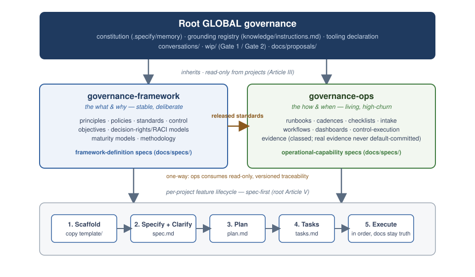

# Hana-X SDD-Core



SDD-Core is the source repository for an AI-native Spec-Driven Development
framework and its operational-governance contracts. It defines methodology,
human authority, adoption, compatibility, and evidence boundaries. It is not a
portfolio workspace, application runtime, project container, or execution
engine.

## Responsibility model

| Component | Responsibility | Boundary |
|---|---|---|
| SDD-Core | Methodology, governance, lifecycle, adoption, compatibility, and evidence contracts | Does not execute project work or store portfolio state |
| FRAMEWORK-DEFINITION | Reusable principles, standards, policy, and decision rights—the what and why | Does not operate controls or missions |
| OPERATIONAL-GOVERNANCE | Reusable procedures, cadences, record shapes, and evidence operations—the how and when | Does not redefine policy or hold live project state |
| Adopter repository | Requirements, implementation, runtime, persistence, releases, conversations, and evidence | Remains independently owned |
| Agent Workflow | Durable coordination and scheduling of authorized missions | Does not execute agents or mint authority |
| Fusion Harness | Execution of verified mission envelopes | Does not own project truth or mint authority |
| CI and review services | Deterministic and advisory evidence | Evidence is not approval |
| Agent Zero | Non-delegable directing authority | Approval is item- and action-specific |

## Repository structure

```text
sdd-core/
├── .specify/memory/constitution.md
├── governance/
│   ├── framework/
│   └── operations/
├── contracts/
│   ├── adoption/
│   ├── authority/
│   └── evidence/
├── integrations/
│   ├── fusion-harness/
│   ├── agent-workflow/
│   └── ci-cd/
├── bootstrap/
├── templates/project/
├── docs/
├── conversations/
├── knowledge/
├── reference/
├── wip/
├── .claude/
├── .agents/
├── .codex/
└── verify-layout.sh
```

Application projects do not live inside SDD-Core. Each has its own repository
and adopts a pinned SDD-Core release through
[the adoption contract](contracts/adoption/README.md).

## Context loading

Read in this order:

1. [root constitution](.specify/memory/constitution.md);
2. [global grounding registry](knowledge/instructions.md);
3. the applicable internal-domain [scope document](governance/);
4. the active approved specification, plan, and tasks;
5. the exact grounded sources required by the work.

Assistant skills and plugins are subordinate tooling. They never displace this
authority order or create approval.

## Governed lifecycle

Substantive change uses distinct artifacts:

```text
WIP exploration
  -> Gate 1 promotion
  -> spec.md
  -> plan.md
  -> tasks.md
  -> Gate 2 implementation
  -> execute
  -> validate
  -> independent review
  -> separate merge/release authority
```

Gate 1 and Gate 2 are issued only by Agent Zero or an explicitly recognized
human authority source. WIP, discussion, praise, commits, reviews, CI, evidence,
Workflow state, Harness state, or merge status cannot imply approval.

Internal framework work uses
[governance/framework/docs/specs/](governance/framework/docs/specs/).
Internal operational-governance work uses
[governance/operations/docs/specs/](governance/operations/docs/specs/).
Repository-wide architecture and contract changes use [docs/specs/](docs/specs/).

## Adoption and operationalization

The architecture-neutral [project template](templates/project/) installs
governance and adoption records without prescribing an application stack.
[Operationalization](bootstrap/new-project.md) installs mandatory bindings and
returns a deterministic readiness state.

Opening an operationalized project may perform read-only metadata inspection
and context assembly. It performs no code execution, network access, secret
access, hook invocation, governed mutation, model call, or agent start.
Execution remains dormant until a valid mission envelope is verified.

## Integration posture

Fusion Harness installation is mandatory and automatic during
operationalization, while execution remains dormant. Agent Workflow registration
is automatic and read-only. A Workflow outage may yield `DEGRADED` only with
an adopted degraded policy and valid pre-issued mission envelope; otherwise it
is `BLOCKED`.

Autonomous remediation is deliberately disabled. CI/CD is review-only.

## Knowledge formats

- Markdown: atomic framework and governance knowledge with strict YAML front
  matter and relative links.
- JSON: closed schemas, contract instances, and tool-call payloads.
- YAML: human-edited adoption, compatibility, and configuration profiles.

## Verification

Install the exact validation dependencies, then run:

```sh
python -m pip install --require-hashes -r requirements-validation.txt
bash verify-layout.sh
```

The canonical verifier validates structure, contracts, fixtures, authority
boundaries, links, secret/path exclusions, adapter invariants, and Linux/Windows
parity. A passing result is evidence, never merge or release authority.

See [docs/README.md](docs/README.md), [CONTRIBUTING.md](CONTRIBUTING.md), and
[SECURITY.md](SECURITY.md).
